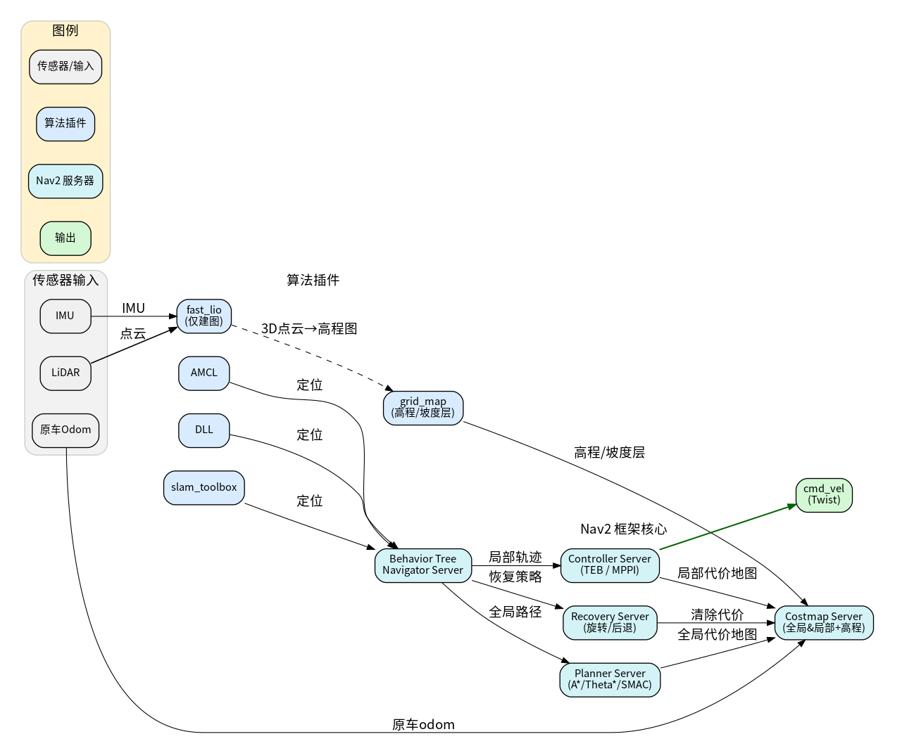

# Slash Navigation README
##  环境配置
X86 (N100)
1. 克隆仓库
   
  ```sh
    git clone git@github.com:theqiao3/slash_ws.git
  ```
2. 安装 [Livox SDK2](https://github.com/Livox-SDK/Livox-SDK2)
   
    ```sh
    sudo apt install cmake
    ```

    ```sh
    git clone https://github.com/Livox-SDK/Livox-SDK2.git
    cd ./Livox-SDK2/
    mkdir build
    cd build
    cmake .. && make -j
    sudo make install
    ```

3. 安装依赖
    ```sh
    rosdep install -r --from-paths src --ignore-src --rosdistro $ROS_DISTRO -y
    ```
    ps：大概率rosdep连接超时，手动用二进制apt安装需要的依赖

4. 编译

    ```sh
    colcon build --symlink-install
    ```
    ps：--symlink-instal方便调试参数文件不用二次编译，
        --packages-select编译指定包
## 框架图

## 概述

本仓库实现了基于ROS2 Humble的机器人导航系统，适用于Ubuntu 22.04环境。系统集成了多种定位算法、规划算法和感知模块，支持多种传感器输入和导航模式。

## 整体框架

仓库按功能模块组织为以下包结构：

### slash_hardware (硬件接口)
- **f1tenth_system**: F1Tenth赛车系统集成
- **livox_ros_driver2**: Livox激光雷达驱动

### slash_localization (定位模块)
- **dll**: 3D激光雷达定位算法
- **FAST_LIO**: 快速LiDAR-惯性里程计，支持多种激光雷达类型
- **icp_localization**: ICP点云配准定位

### slash_navigation (导航模块)
- **costmap_converter**: 代价地图转换工具
- **nav2_msg_costmap_plugin**: Nav2代价地图插件
- **slash_nav2**: 自定义Nav2导航包，包含多种定位方案
- **teb_local_planner**: 时间弹性带局部规划器

### slash_perception (感知模块)
- **grid_map**: 通用网格地图库，支持多层数据
- **linefit_ground_segmentation**: 地面分割算法
- **pointcloud_filter**: 点云滤波器
- **pointcloud_to_laserscan**: 点云转激光扫描

## 导航启动流程

### 主要启动流程

1. **bringup_all.launch.py**: 完整导航系统启动
   - 启动地面分割 (linefit_ground_segmentation)
   - 启动导航系统 (slash_nav2/bringup_with_slam_toolbox.launch.py)

2. **bringup_with_slam_toolbox.launch.py**: SLAM Toolbox定位模式
   - 调用bringup_launch.py
   - 包括localization_launch.py (地图服务 + SLAM定位)
   - 包括navigation_launch.py (控制器、规划器等)

3. **bringup_launch.py**: 核心导航启动
   - 根据slam参数选择定位模式
   - 启动localization_launch.py和navigation_launch.py

### 定位模式

系统支持多种定位方案：

- **AMCL定位**: 基于粒子滤波的2D激光定位
- **SLAM Toolbox定位**: 基于序列化地图的激光定位
- **DLL 3D定位**: 3D激光雷达定位
- **Grid Map + SLAM Toolbox**: 网格地图增强的SLAM定位

## 单独启动命令

### 完整系统启动
```bash
# 建图
ros2 launch tianracer_bringup tianracer_bringup.launch.py

ros2 launch slash_nav2 bringup_all_mapping.launch.py #FAST_LIO2+slam_toolbox

octmap建立（使用dll定位时启用）：ros2 run octomap_server octomap_server_node     --ros-args     -p resolution:=0.1     -r /cloud_in:=/livox/lidar/pointcloud

地图保存：ros2 service call /map_save std_srvs/srv/Trigger "{}"

slam_toolbox存图：ros2 service call /slam_toolbox/serialize_map slam_toolbox/srv/SerializePoseGraph \
  "{filename: '/home/tianbot/slash_ws/src/slash_navigation/slash_nav2/map/test1'}"

pcd转栅格（可选）：cd /home/tianbot/slash_ws/src/slash_navigation/slash_nav2/scripts
    python3 pcd_to_pgm.py /home/tianbot/slash_ws/src/slash_navigation/slash_nav2/PCD/test1.pcd /home/tianbot/slash_ws/src/slash_navigation/slash_nav2/map/test1 --resolution 0.05 --height-min 0.01 --height-max 1.5

保存为.bt格式（octmap建图时使用）： ros2 run octomap_server octomap_saver_node     --ros-args -p octomap_path:=/home/tianbot/slash_ws/src/slash_localization/dll/maps/test1.bt

# 建图后导航
ros2 launch tianracer_bringup tianracer_bringup.launch.py

ros2 launch slash_nav2 bringup_all.launch.py
```

### 不同定位方案
 # 如果需要切换不同方案和定位，需要在bringup_all.launch.py文件中将相应的某行注释取消则行：        
    # 选择一个定位方案（取消注释其中一行）:
            #("slash_nav2", "bringup_real.launch.py"),            # 官方 AMCL
            #("slash_nav2", "bringup_with_dll.launch.py"),        # DLL 3D定位
            ("slash_nav2", "bringup_with_slam_toolbox.launch.py"), # SLAM Toolbox 定位
            #("slash_nav2", "bringup_gridmap_toolbox.launch.py"), # Grid Map + SLAM Toolbox  

### 单独启动测试 
```bash
# SLAM Toolbox定位（默认）
ros2 launch slash_nav2 bringup_with_slam_toolbox.launch.py

# AMCL定位
ros2 launch slash_nav2 bringup_real.launch.py

# DLL 3D定位
ros2 launch slash_nav2 bringup_with_dll.launch.py

# Grid Map + SLAM Toolbox
ros2 launch slash_nav2 bringup_gridmap_toolbox.launch.py

# 地面分割
ros2 launch linefit_ground_segmentation_ros segmentation.launch.py

# 点云转激光（现已不需要，融合进了地面分割节点中）
ros2 launch pointcloud_to_laserscan pointcloud_to_laserscan_launch.py
```

## 算法框架

### 定位算法

#### FAST-LIO (建图用，也可更改相关frame用于提供里程计)
- **特点**: 计算高效、鲁棒性强，支持快速运动和噪声环境
- **功能**: 
  - 紧耦合迭代扩展卡尔曼滤波
  - 自动初始化
  - 并行KD树搜索
- **支持传感器**: Velodyne、Ouster、Livox等各种激光雷达
- **更新频率**: 支持100Hz以上

#### ICP Localization（还未适配，可测试）
- **算法**: 迭代最近点(ICP)点云配准
- **应用**: 基于先验地图的精确定位

#### DLL (Direct LiDAR Localization)
- **特点**: 3D激光雷达直接定位
- **配准方法**: DLL、NDT、ICP可选
- **地图格式**: 支持.bt八叉树地图

#### SLAM Toolbox
- **功能**: 基于序列化地图的定位模式
- **地图格式**: .posegraph序列化地图 + .data数据文件

### 规划算法

#### Nav2全局规划器
- **框架**: ROS2 Navigation2
- **算法**: A*、Dijkstra等
- **特点**: 支持多层代价地图

#### TEB局部规划器 (Timed Elastic Band)
- **特点**: 
  - 时间最优轨迹规划
  - 考虑运动学约束
  - 障碍物避让
- **适用**: 差分驱动和阿克曼转向机器人

### 感知算法

#### Grid Map
- **特点**: 
  - 多层2.5D网格地图
  - 高效地图重定位
  - Eigen数据类型
- **应用**: 地形导航、表面法向量、通行性等

#### Linefit Ground Segmentation
- **算法**: 基于线拟合的地面分割
- **应用**: 从点云中分离地面和障碍物

#### Pointcloud Filter
- **功能**: 点云预处理和滤波
- **集成**: FAST-LIO专用集成

#### Pointcloud to Laserscan
- **功能**: 将3D点云转换为2D激光扫描
- **应用**: 为传统2D导航算法提供数据


## 配置说明

### 参数文件
- 主配置文件: `slash_nav2/config/nav2_params.yaml`

- 包含定位、规划、控制等参数

### 地图文件
- 2D地图: `slash_nav2/map/test1.yaml`
- 3Doctmap地图: `dll/maps/test1.bt`
- 点云地图: `slash_nav2/PCD/test1.pcd`

### RViz配置
- 配置文件: `slash_nav2/rviz/nav2.rviz`

## 依赖关系

### 系统依赖
- Ubuntu 22.04
- ROS2 Humble
- Livox SDK2

### ROS包依赖
- navigation2
- slam_toolbox
- teb_local_planner
- grid_map系列包

## 注意事项

1. 确保Livox SDK2已正确安装
2. 根据硬件配置选择合适的定位方案
3. 地图文件路径需要根据实际情况调整
4. PCD可视化功能默认启用，可通过参数控制
5. 速度校正节点可按需启用

### 日志分析
- 使用`ros2 launch`的`--log-level`参数控制日志级别
- 查看`/rosout`话题获取系统日志</content>
<parameter name="filePath">/home/tianbot/slash_ws/NAVIGATION_README.md
